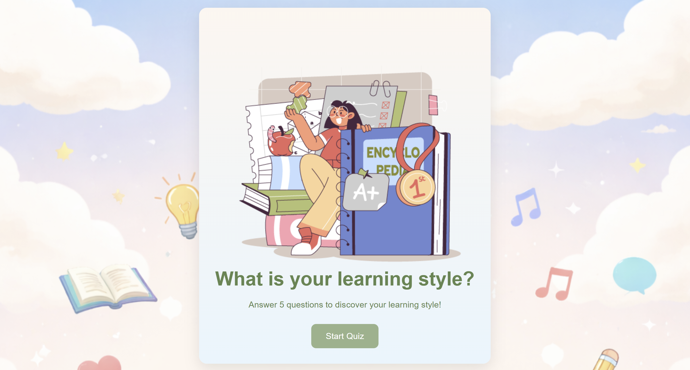
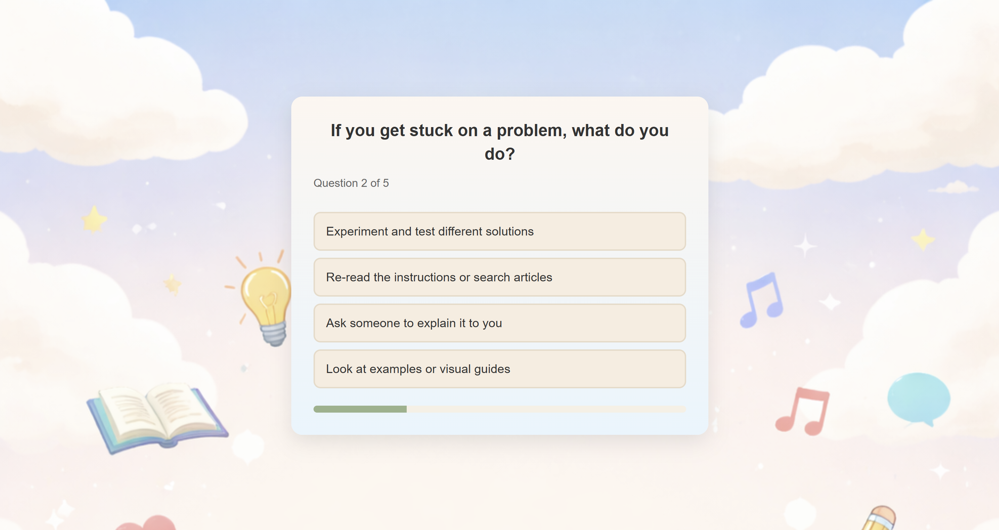
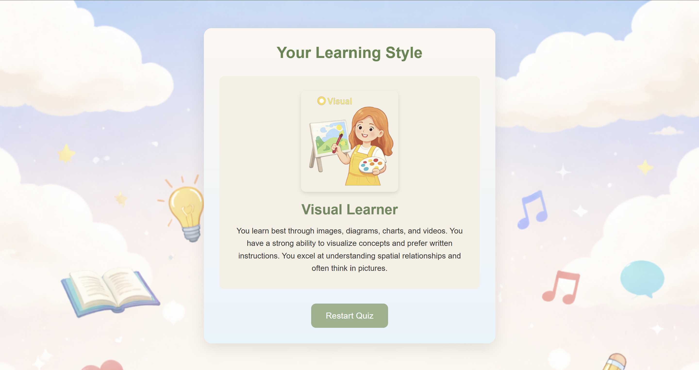

🧠 Learning Style Quiz

An interactive quiz that helps users discover their learning style:
Visual 👀 | Auditory 🎧 | Reading/Writing ✍️ | Kinesthetic 🖐️

This project was built as part of my journey learning web development and becoming a programming teacher. Instead of just following a tutorial, I customized it to focus on education and personalized learning.

🚀 Live Demo
https://phuongphm.github.io/Learning-Style-Quiz/

📸 Preview

🏠 Quiz Start Screen

❓ Question Example

🎯 Result Screen

🎯 Features
4 Learning Styles (VARK Model)
Interactive multiple-choice quiz
Dynamic question rendering
Score tracking system
Instant result display
Beginner-friendly code structure
🛠️ Technologies Used
HTML
CSS
JavaScript (Vanilla)

💡 Project Purpose
I built this project to:
- Practice JavaScript fundamentals
- Learn how to build interactive web apps
- Combine coding with education
- Create useful tools for students
I believe understanding how you learn is the first step to learning better.

👩‍💻 About Me

I’m on a journey to become a programming teacher for kids (ages 5–12).
I create projects that combine coding with education and creativity.

⭐ If you like this project

Give it a star ⭐ and feel free to fork it!
